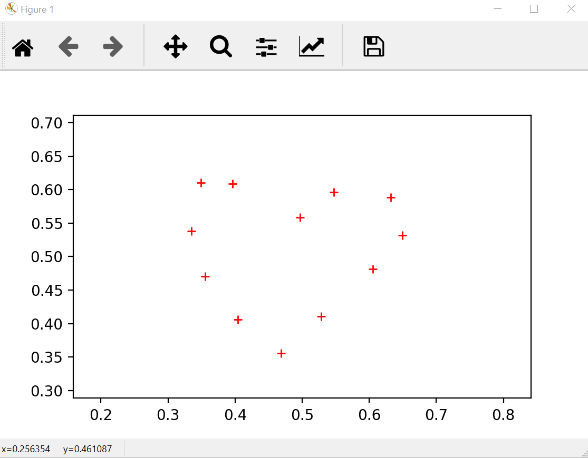

# spline-interpolation
This project discusses how we can use spline interpolation to outline an object of interest.
* In [plotting-a-contour](jupyter-notebooks/plotting-a-contour.ipynb), we introduce the basic idea of cubic interpolation and compare the plotting results via shape-preserving interpolation and spline interpolation.
* In [spline-in-different-conditions](jupyter-notebooks/spline-in-different-conditions.ipynb), we further discuss how spline interpolation in three differnt conditions affects the plotting result.
* In [spline-surface](jupyter-notebooks/spline-surface.ipynb), we apply spline interpolation to bicubic polynomial to plot a surface in three-dimensional space.
---
### Plot an Object of Your Interest
Note that you can also plot the contour of an object of your interest.  
Running get_points.py in the command line and typing the filename of your choice, you will enter an interface that looks like   
  
* Click left mouse button to add points.
* Click right mouse button to remove the most recently added points.  
* Press esc to stop input.  

The coordinates of the clicked points will be written into a file in [points](points) folder. Change the filename in the notebooks to see the plotting result of your newly generated points.
